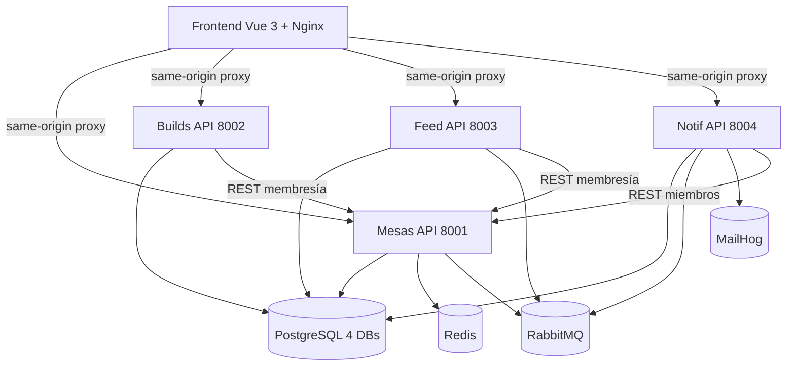
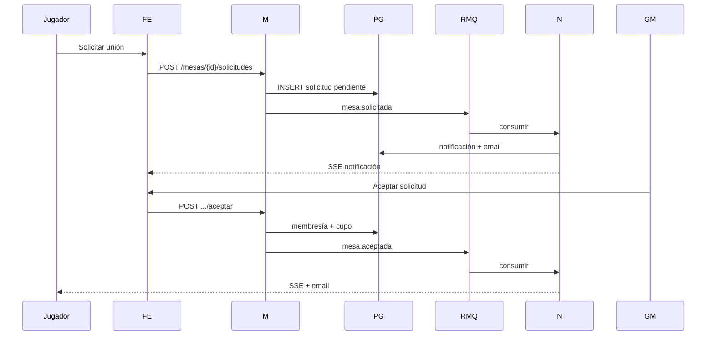
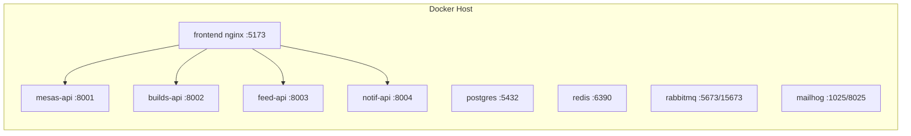

# Diagramas de arquitectura — TFinder

## Componentes

```mermaid
graph TD
    FE[Frontend Vue 3 + Nginx]
    M[Mesas API 8001]
    B[Builds API 8002]
    F[Feed API 8003]
    N[Notif API 8004]
    PG[(PostgreSQL 4 DBs)]
    RD[(Redis)]
    RMQ[(RabbitMQ)]
    MH[(MailHog)]

    FE -->|same-origin proxy| M
    FE -->|same-origin proxy| B
    FE -->|same-origin proxy| F
    FE -->|same-origin proxy| N
    M --> PG
    B --> PG
    F --> PG
    N --> PG
    M --> RD
    M --> RMQ
    F --> RMQ
    N --> RMQ
    N --> MH
    B -->|REST membresía| M
    F -->|REST membresía| M
    N -->|REST miembros| M
```

## Flujo de solicitud de unión

```mermaid
sequenceDiagram
    Jugador->>FE: Solicitar unión
    FE->>M: POST /mesas/{id}/solicitudes
    M->>PG: INSERT solicitud pendiente
    M->>RMQ: mesa.solicitada
    RMQ->>N: consumir
    N->>PG: notificación + email
    N-->>FE: SSE notificación
    GM->>FE: Aceptar solicitud
    FE->>M: POST .../aceptar
    M->>PG: membresía + cupo
    M->>RMQ: mesa.aceptada
    RMQ->>N: consumir
    N-->>Jugador: SSE + email
```

## Despliegue

```mermaid
graph LR
    subgraph Docker Host
        FE2[frontend nginx :5173]
        M2[mesas-api :8001]
        B2[builds-api :8002]
        F2[feed-api :8003]
        N2[notif-api :8004]
        PG2[postgres :5432]
        RD2[redis :6390]
        RMQ2[rabbitmq :5673/15673]
        MH2[mailhog :1025/8025]
    end
    FE2 --> M2
    FE2 --> B2
    FE2 --> F2
    FE2 --> N2
```
